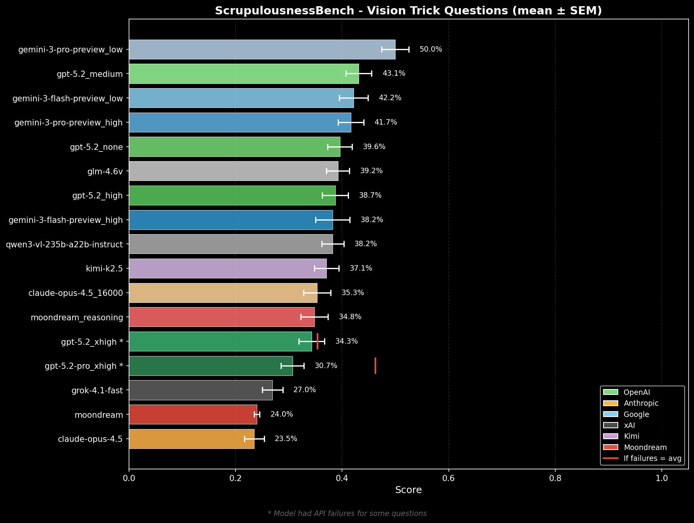
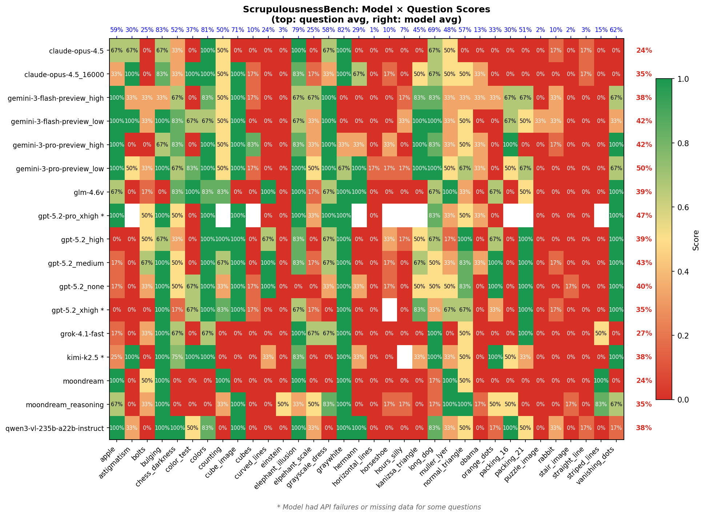

# ScrupulousnessBench

A vision benchmark testing whether AI models carefully analyze images or fall for visual tricks and illusions.





## Overview

ScrupulousnessBench presents models with deceptive visual questions where the obvious answer is usually wrong. It tests:

- **Optical illusions** - Do models fall for classic illusions (Ebbinghaus, Muller-Lyer, etc.)?
- **Trick questions** - Can models recognize when a premise is false?
- **Careful observation** - Do models count/measure precisely or make assumptions?
- **Critical thinking** - Do models question misleading claims about images?

*Reasoning effort levels in parentheses. Higher reasoning effort often hurts performance on these trick questions.*

## Installation

```bash
# Clone and setup
git clone <repo>
cd ScrupulousnessBench

# Create virtual environment
python -m venv .venv
source .venv/bin/activate  # or .venv\Scripts\activate on Windows

# Install dependencies
pip install -r requirements.txt

# Set API keys
export OPENROUTER_API_KEY="your-key"
export MOONDREAM_API_KEY="your-key"  # optional, for Moondream models
```

## Usage

### Run Benchmark

```bash
# Single model
python harness.py --models "openai/gpt-5.2" --samples 3

# Multiple models
python harness.py --models "google/gemini-3-pro-preview:high" "anthropic/claude-opus-4.5" --samples 3

# With reasoning effort (for models that support it)
python harness.py --models "openai/gpt-5.2:medium" --samples 3

# Disable reasoning
python harness.py --models "openai/gpt-5.2:off" --samples 3

# Resume from existing results (only run new/missing examples)
python harness.py --models "openai/gpt-5.2:off" --resume --samples 3

# Limit examples for testing
python harness.py --models "openai/gpt-5.2" --samples 1 --limit 5
```

### Model Specification

Models can include reasoning configuration:
- `model:off` / `model:none` - Disable reasoning
- `model:low` / `model:medium` / `model:high` - Set reasoning effort
- `model:1000` - Set max reasoning tokens
- `moondream:reasoning` - Enable Moondream reasoning mode

### Visualize Results

```bash
# Generate plots (light and dark themes)
python scripts/plot_results.py

# Generate score grid
python scripts/plot_grid.py

# View in browser
python server/server.py
# Open http://localhost:8765
```

## Project Structure

```
ScrupulousnessBench/
├── harness.py              # Main benchmark harness
├── data.enc                # Encrypted benchmark data
├── server/
│   ├── server.py           # Web server for viewing results
│   └── static/             # Web UI assets
├── scripts/
│   ├── plot_results.py     # Generate bar chart visualizations
│   ├── plot_grid.py        # Generate score grid visualization
│   ├── encrypt_data.py     # Encrypt data/ directory
│   └── decrypt_data.py     # Runtime decryption module
├── results/                # Model evaluation results
│   └── *_results.json
├── outputs/                # Generated visualizations
│   ├── scores_light.png
│   ├── scores_dark.png
│   └── score_grid.png
└── images/                 # Documentation images
```

## Data Encryption

Benchmark data is encrypted to prevent accidental training contamination from web scrapers. The harness decrypts data at runtime automatically.

To modify the benchmark:

1. Create a `data/` directory with your examples
2. Add JSON + image files (see format below)
3. Run `python scripts/encrypt_data.py` to generate `data.enc`
4. Delete `data/` before committing

## Adding New Examples

Create a JSON file and matching image in `data/`:

```json
{
  "question": "What do you see in this image?",
  "answer": "The expected correct answer",
  "image_ext": "png"
}
```

The question should be designed so that:
1. A quick/careless answer would be wrong
2. Careful analysis reveals the trick
3. The expected answer reflects the correct observation

After adding examples, run `python encrypt_data.py` to update `data.enc`.

## Grading

Models are graded by Claude Opus 4.5 with access to both the image and the model's response:
- **1.0** - Correctly identified the trick/illusion
- **0.5** - Partially correct (noticed something off)
- **0.0** - Fell for the trick

## Provider Routing

The harness routes requests to original providers for full precision:
- OpenAI models → OpenAI
- Anthropic models → Anthropic
- Google models → Google
- Qwen models → Alibaba
- GLM models → Z.AI
- xAI models → xAI

This avoids potentially quantized third-party hosts.

## Web UI

Run `python server.py` and open http://localhost:8765 to browse results interactively. The UI shows each example's image, the model responses, and grading explanations.


## License

MIT
